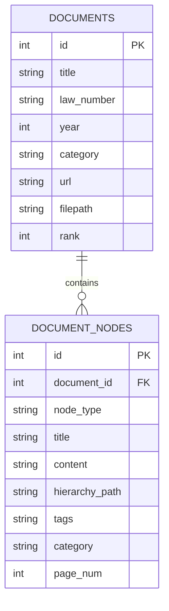

# Documento Rector y Guía Técnica: Sistema de Gestión e Indexación de Contratación Pública en Colombia

Este documento funciona como la **Guía Rectora** del sistema de extracción, procesamiento, etiquetado jerárquico e indexación de la normativa de Contratación Pública Estatal de Colombia. Detalla la arquitectura de software, la jerarquía de precedencia normativa, las reglas de clasificación semántica y la estructura de datos establecida.

---

## 1. Arquitectura del Sistema y Estructura de Directorios

El sistema está desarrollado en **Python 3.12** utilizando un entorno virtual autónomo y librerías ligeras sin dependencias externas de OCR o motores pesados, priorizando el rendimiento, la velocidad y la portabilidad.

### Estructura del Workspace
```text
j:/Mi unidad/NV/
├── .venv/                      # Entorno virtual con dependencias
├── data/
│   ├── procurement_normative.db # Base de datos relacional y virtual (FTS5)
│   └── raw/                    # Documentos originales descargados (HTML y PDF)
├── src/
│   ├── db_manager.py           # Gestor de base de datos SQLite y FTS5
│   ├── downloader.py           # Descargador automático con User-Agent y bypass SSL
│   ├── parser.py               # Extractor de HTML (SUIN) y PDF (CCE) con deduplicación
│   ├── query.py                # Interfaz CLI de consulta y módulo RAG con Gemini
│   └── tagger.py               # Motor de etiquetado semántico y clasificación
└── main.py                     # Orquestador del pipeline completo
```

---

## 2. Jerarquía Normativa y Criterios de Clasificación

Para respetar el principio constitucional de la pirámide de Kelsen en el derecho administrativo colombiano, donde las normas reglamentarias y guías no pueden contravenir o estar por encima de las leyes, el sistema define un **Rango de Precedencia**:

| Rango Jerárquico | Tipo de Norma | Documentos Incluidos | Fuerza Jurídica |
| :--- | :--- | :--- | :--- |
| **Rango 1** | **Leyes** | Ley 80 de 1993, Ley 1150 de 2007 | **Máxima y vinculante**. Prevalece sobre decretos y manuales. |
| **Rango 2** | **Decreto Reglamentario** | Decreto 1082 de 2015 | **Reglamentaria**. Prevalece sobre guías y manuales técnicos. |
| **Rango 3** | **Guías y Manuales Técnicos** | Manual de Riesgos, Estudios de Sector, Supervisión, etc. | **Orientativa**. Subordinada a Leyes y Decretos. |

### Clasificación en la Base de Datos
Cada fragmento procesado se agrupa en una de las siguientes **tres categorías principales**:
1. `Principios y Normas Generales`: Normas que definen el marco jurídico y procedimental.
2. `Modalidades de Selección`: Reglas específicas sobre Licitación Pública, Selección Abreviada, Concurso de Méritos, Contratación Directa y Mínima Cuantía.
3. `Guías Operativas y Manuales de Entidad`: Lineamientos prácticos y guías metodológicas de Colombia Compra Eficiente (CCE).

---

## 3. Motor de Etiquetado Semántico (Tagger)

Cada artículo o sección es analizado y etiquetado automáticamente mediante reglas basadas en expresiones regulares de palabras clave en español:

| Etiqueta Semántica | Palabras Clave de Búsqueda (Regex) |
| :--- | :--- |
| `#Garantías` | `garantía`, `póliza`, `amparo`, `asegurador`, `caución`, `fiador` |
| `#Anticipos` | `anticipo`, `pago anticipado` |
| `#CapacidadResidual` | `capacidad residual`, `capacidad de contratación`, `k de contratación` |
| `#Riesgos` | `riesgo`, `matriz de riesgo`, `previsible`, `mitigación`, `cobertura`, `tipificación` |
| `#Supervisión` | `supervisión`, `supervisor`, `interventoría`, `interventor` |
| `#OfertasBajas` | `artificialmente baja`, `precio artificial`, `oferta baja` |
| `#Principios` | `principio`, `transparencia`, `economía`, `responsabilidad`, `igualdad`, `buena fe`, `debido proceso`, `selección objetiva` |
| `#Licitación` | `licitación`, `pliego de condiciones` |
| `#SelecciónAbreviada`| `selección abreviada`, `menor cuantía`, `subasta inversa`, `acuerdo marco` |
| `#ConcursoMéritos` | `concurso de méritos`, `criterio técnico`, `consultor`, `consultoría` |
| `#ContrataciónDirecta`| `contratación directa`, `urgencia manifiesta`, `proveedor único`, `prestación de servicios` |
| `#MínimaCuantía` | `mínima cuantía`, `invitación pública` |
| `#Planeación` | `planeación`, `estudio previo`, `estudio de sector`, `análisis del sector` |
| `#Liquidación` | `liquidación`, `liquidar`, `acta de liquidación` |
| `#Sanciones` | `sanción`, `multa`, `incumplimiento`, `caducidad`, `cláusula penal` |

---

## 4. Estructura de Datos y Modelo de Almacenamiento

### Esquema Relacional (SQLite)
La base de datos relacional almacena la estructura original y permite consultas cruzadas de metadatos:



### Motor de Búsqueda Virtual (FTS5)
Para lograr búsquedas ultra-rápidas con insensibilidad a acentos e insensible a mayúsculas/minúsculas en español, creamos una tabla virtual de búsqueda de texto completo con la extensión `FTS5`:
```sql
CREATE VIRTUAL TABLE document_nodes_fts USING fts5(
    node_id UNINDEXED,
    document_title,
    node_type,
    title,
    content,
    tags,
    category,
    tokenize="unicode61 remove_diacritics 1"
);
```
El tokenizador `unicode61 remove_diacritics 1` remueve de forma nativa los acentos del español (tildes), permitiendo que la búsqueda de "seleccion" encuentre "selección".

---

## 5. Lógica de Consulta y Reglas RAG (Generative Q&A)

### Búsqueda Jerárquica
Cuando se realiza una consulta de palabras clave, el sistema ejecuta la ordenación de resultados según la jerarquía normativa de Kelsen:
```sql
SELECT dn.id, d.title, dn.content, d.rank, fts.rank 
FROM document_nodes_fts fts
JOIN document_nodes dn ON fts.node_id = dn.id
JOIN documents d ON dn.document_id = d.id
WHERE document_nodes_fts MATCH ?
ORDER BY d.rank ASC, fts.rank ASC
LIMIT ?
```
1. **`d.rank ASC`**: Primero muestra Leyes (Rango 1), luego Decretos (Rango 2), y finalmente Manuales (Rango 3).
2. **`fts.rank ASC`**: Dentro de cada rango jerárquico, ordena los fragmentos de mayor a menor relevancia utilizando el algoritmo de puntuación **BM25**.

### Reglas para Síntesis de Respuestas (RAG)
El módulo RAG que interactúa con la API de Gemini tiene instrucciones explícitas para evitar que los manuales contradigan a la ley:
> *"Si en los fragmentos de soporte hay contradicción o conflicto entre lo dispuesto por una Ley (Rango 1) o Decreto (Rango 2) y lo dispuesto por un Manual o Guía (Rango 3), debes priorizar y hacer prevalecer lo establecido en la Ley o el Decreto. Explica esta supremacía en tu respuesta si es relevante para el caso."*

---

## 6. Mecanismos de Limpieza y Deduplicación

Para mitigar duplicidades y ruido en las búsquedas (comunes en páginas web institucionales debido a índices repetitivos y pies de página), el sistema implementa:
1. **Travesía por Nodos Hoja:** El parser solo extrae texto de elementos HTML que no contengan sub-elementos de texto internos (`<p>`, `<div>`, `<td>`).
2. **Filtro de Contenido Único:** Un filtro de hash por contenido a nivel de objeto que elimina cualquier nodo duplicado antes de insertarlo en la base de datos, garantizando la unicidad de cada fragmento normativo indexado.
